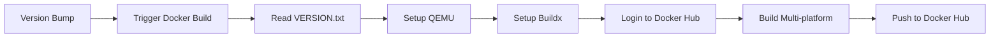

# GitHub Actions Workflows Guide

This document explains the automated workflows configured in this project.

## 📋 Overview

OmniView uses three GitHub Actions workflows to automate development and deployment:

1. **Upstream Sync** - Keeps forks synchronized with the main repository
2. **Version Bump** - Automatically updates version numbers
3. **Docker Build** - Builds and publishes multi-platform Docker images

## 🔄 Workflow 1: Upstream Sync

**File**: `.github/workflows/sync.yml`

### Purpose
Automatically synchronizes your forked repository with the upstream (main) repository to keep your fork up-to-date.

### Trigger
- **Scheduled**: Daily at 12 PM UTC+8 (4 AM UTC)
- **Manual**: Can be triggered manually via GitHub Actions UI

### How It Works

```yaml
schedule:
  - cron: "0 4 * * *" # Runs at 4 AM UTC (12 PM UTC+8)
```

The workflow:
1. Checks out your repository
2. Fetches changes from `CrueChan/OmniView`
3. Merges changes into your `main` branch
4. Pushes updates to your fork

### Requirements
- Works **only on forked repositories**
- Requires GitHub Actions to be enabled in your fork

### Enabling for Your Fork

1. Navigate to your fork on GitHub
2. Go to the **Actions** tab
3. If prompted, click "I understand my workflows, go ahead and enable them"
4. The sync will run automatically daily

### Manual Sync

To manually trigger a sync:
1. Go to **Actions** tab
2. Select **Upstream Sync** workflow
3. Click **Run workflow** button
4. Select branch (usually `main`)
5. Click **Run workflow**

### Troubleshooting

If sync fails:
- Check if there are merge conflicts
- The workflow will create an error message
- You may need to manually resolve conflicts:

```bash
git clone https://github.com/YourUsername/OmniView.git
cd OmniView
git remote add upstream https://github.com/CrueChan/OmniView.git
git fetch upstream
git merge upstream/main
# Resolve any conflicts
git push origin main
```

---

## 📌 Workflow 2: Version Bump

**File**: `.github/workflows/version.yml`

### Purpose
Automatically updates the version number in `VERSION.txt` based on current timestamp whenever code is pushed to the main branch.

### Trigger
- **Push to main branch**
- **Manual dispatch**

### How It Works

The workflow:
1. Checks out the repository
2. Generates a timestamp version (format: `YYYYMMDDHHMM`)
3. Updates `VERSION.txt`
4. Commits and pushes the changes
5. Cleans up old workflow runs (keeps last 2)

### Version Format

Versions use timestamp format:
- Example: `202401151230` = January 15, 2024, 12:30 PM
- Timezone: Europe/Berlin (configurable via `TZ` environment variable)

### Important Notes

- **Only runs on main repository**: `CrueChan/OmniView`
- Forks will not trigger automatic version bumps
- Uses GitHub Actions bot for commits

### Configuration

```yaml
env:
  TZ: 'Europe/Berlin'  # Change this to your timezone if needed
```

### Customization for Forks

If you want version bumping in your fork:

1. Edit `.github/workflows/version.yml`
2. Change the condition:
```yaml
if: github.repository == 'YourUsername/OmniView'
```

---

## 🐳 Workflow 3: Docker Image Build

**File**: `.github/workflows/docker-build.yml`

### Purpose
Builds and publishes multi-platform Docker images to Docker Hub automatically after version updates.

### Trigger
- **After successful version bump** (automatic)
- **Manual dispatch**

### Supported Platforms

The workflow builds images for:
- `linux/amd64` (x86_64 - Intel/AMD processors)
- `linux/arm64/v8` (ARM 64-bit - Raspberry Pi 4, Apple Silicon)
- `linux/arm/v7` (ARM 32-bit - Older Raspberry Pi models)

### Image Tags

For the main repository (`CrueChan/OmniView`):
- `CrueChan/omniview:latest` - Always points to newest build
- `CrueChan/omniview:YYYYMMDDHHMM` - Version-specific tag

For forks:
- `YourUsername/omniview-beta:latest` - Beta/test builds

### How It Works



### Setting Up Docker Hub Publishing for Your Fork

To enable Docker image publishing in your fork:

#### Step 1: Create Docker Hub Account
1. Go to [hub.docker.com](https://hub.docker.com)
2. Sign up for a free account
3. Create a new repository (optional - will be created automatically)

#### Step 2: Generate Access Token
1. Go to **Account Settings** > **Security**
2. Click **New Access Token**
3. Name: `github-actions`
4. Permissions: **Read, Write, Delete**
5. Copy the generated token (you won't see it again!)

#### Step 3: Add Secrets to GitHub
1. Go to your fork on GitHub
2. Navigate to **Settings** > **Secrets and variables** > **Actions**
3. Click **New repository secret**
4. Add two secrets:

**Secret 1: DOCKER_USERNAME**
- Name: `DOCKER_USERNAME`
- Value: Your Docker Hub username

**Secret 2: DOCKER_PASSWORD**
- Name: `DOCKER_PASSWORD`
- Value: The access token you generated

#### Step 4: Modify Workflow (Optional)
If you want custom image naming:

Edit `.github/workflows/docker-build.yml`:

```yaml
- name: Set Docker image tag based on repository
  id: set-tag
  run: |
    if [ "${{ github.repository }}" = "YourUsername/OmniView" ]; then
      echo "IMAGE_NAME=my-custom-omniview" >> $GITHUB_OUTPUT
      echo "TAGS=${{ secrets.DOCKER_USERNAME }}/my-custom-omniview:latest,${{ secrets.DOCKER_USERNAME }}/my-custom-omniview:${{ steps.version.outputs.VERSION }}" >> $GITHUB_OUTPUT
    else
      echo "IMAGE_NAME=omniview-beta" >> $GITHUB_OUTPUT
      echo "TAGS=${{ secrets.DOCKER_USERNAME }}/omniview-beta:latest" >> $GITHUB_OUTPUT
    fi
```

### Manual Build

To manually trigger a Docker build:

1. Go to **Actions** tab
2. Select **Build OmniView image** workflow
3. Click **Run workflow**
4. Select branch
5. Click **Run workflow**

### Monitoring Builds

Track build progress:
1. Go to **Actions** tab
2. Click on the running workflow
3. Expand **Build and push OmniView image** step
4. View real-time build logs

### Build Time

Typical build times:
- **amd64**: ~2-3 minutes
- **arm64**: ~3-4 minutes
- **arm/v7**: ~4-5 minutes
- **Total**: ~8-12 minutes for all platforms

---

## 🔒 Security Best Practices

### Secrets Management

**✅ DO:**
- Use GitHub Secrets for sensitive data
- Rotate access tokens periodically
- Use access tokens instead of passwords
- Limit token permissions to minimum required

**❌ DON'T:**
- Commit secrets to the repository
- Share secrets publicly
- Use personal passwords as tokens
- Grant unnecessary permissions

### Workflow Permissions

Review workflow permissions in repository settings:
1. Go to **Settings** > **Actions** > **General**
2. Under **Workflow permissions**, ensure appropriate settings
3. For this project: **Read and write permissions** required

---

## 📊 Workflow Status Badges

Add status badges to your README to show workflow status:

```markdown


```

---

## 🐛 Troubleshooting

### Workflow Not Running

**Problem**: Workflow doesn't trigger automatically

**Solutions**:
1. Check if Actions are enabled: **Settings** > **Actions** > **General**
2. Verify workflow file syntax: Use [actionlint](https://github.com/rhysd/actionlint)
3. Check branch name matches trigger configuration

### Docker Build Fails

**Problem**: Docker build fails with permission error

**Solutions**:
1. Verify Docker Hub credentials in Secrets
2. Check if access token has write permissions
3. Ensure repository exists on Docker Hub (or set to auto-create)

### Sync Conflicts

**Problem**: Upstream sync fails due to conflicts

**Solutions**:
1. Manually resolve conflicts locally
2. Force sync (may lose local changes):
```bash
git fetch upstream
git reset --hard upstream/main
git push --force origin main
```

### Version File Not Updating

**Problem**: VERSION.txt not being updated

**Solutions**:
1. Check if workflow condition matches: `github.repository == 'YourUsername/OmniView'`
2. Verify bot has push permissions
3. Check workflow logs for error messages

---

## 📈 Monitoring and Maintenance

### Regular Checks

Perform these checks monthly:

- [ ] Review workflow run history
- [ ] Check for failed builds
- [ ] Update dependencies in workflow files
- [ ] Rotate access tokens (every 6 months)
- [ ] Review and clean old Docker images

### Useful Commands

```bash
# View all workflow runs
gh run list

# View specific workflow
gh run list --workflow="docker-build.yml"

# View logs for a run
gh run view <run-id> --log

# Re-run a failed workflow
gh run rerun <run-id>
```

---

## 📚 Additional Resources

- [GitHub Actions Documentation](https://docs.github.com/en/actions)
- [Docker Build Push Action](https://github.com/docker/build-push-action)
- [Fork Sync Action](https://github.com/aormsby/Fork-Sync-With-Upstream-action)
- [Docker Hub Documentation](https://docs.docker.com/docker-hub/)

---

## 🆘 Getting Help

If you encounter issues with workflows:

1. Check workflow logs in the Actions tab
2. Review this guide for common solutions
3. Search existing [GitHub Issues](https://github.com/CrueChan/OmniView/issues)
4. Create a new issue with:
   - Workflow name
   - Error message
   - Screenshot of logs
   - Steps to reproduce

---

**Last Updated**: 2024-01-15